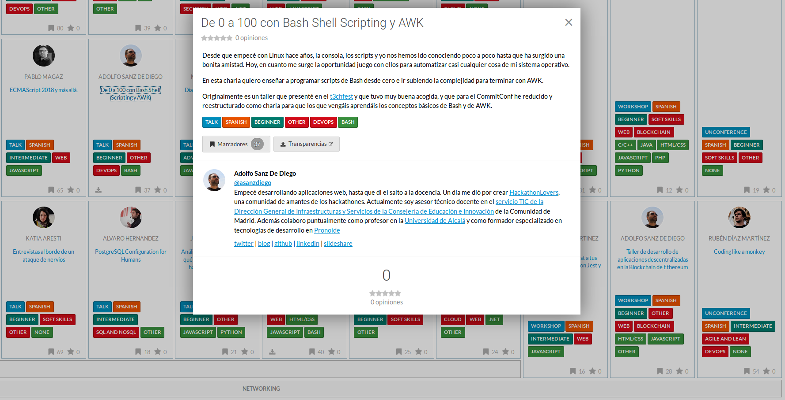
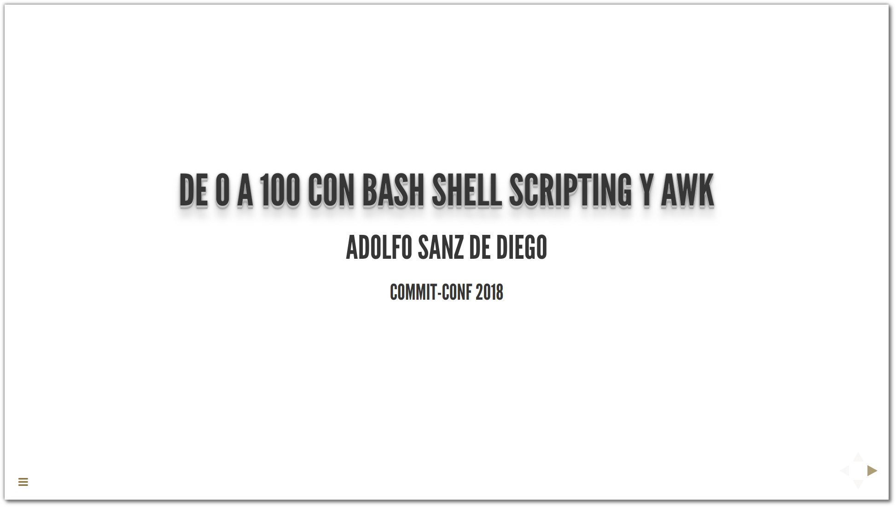
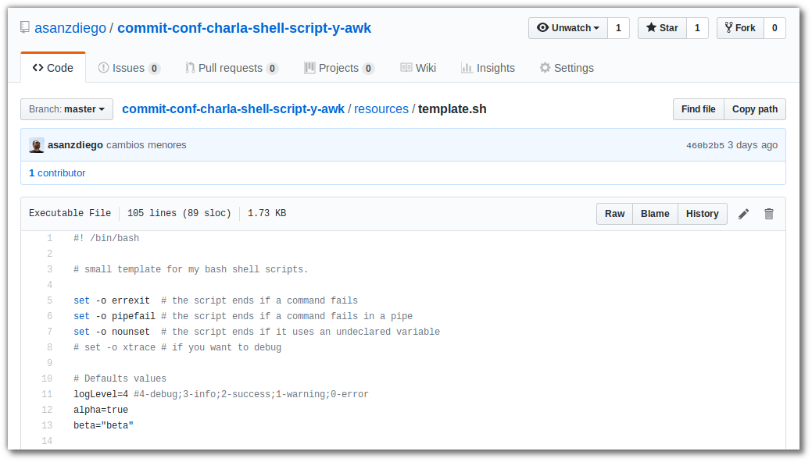
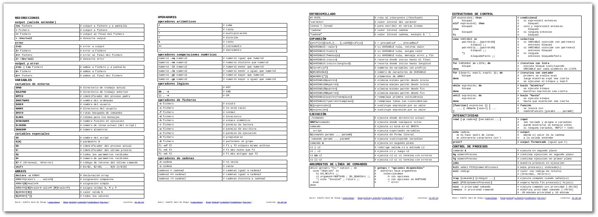
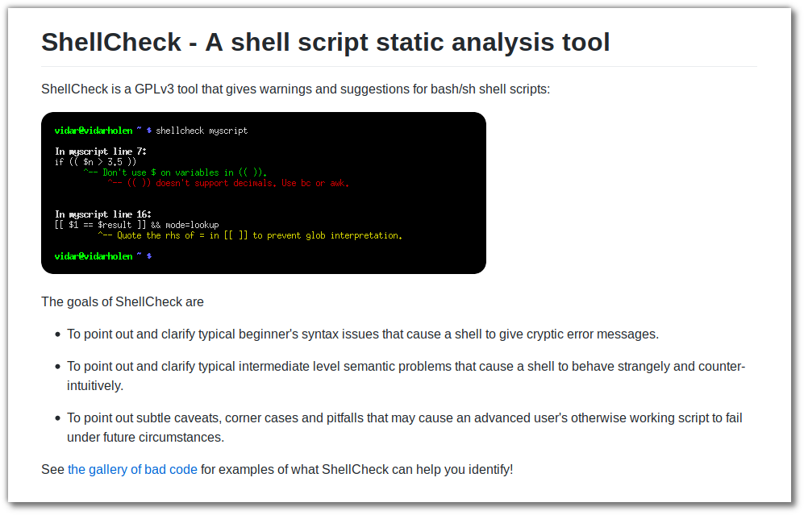
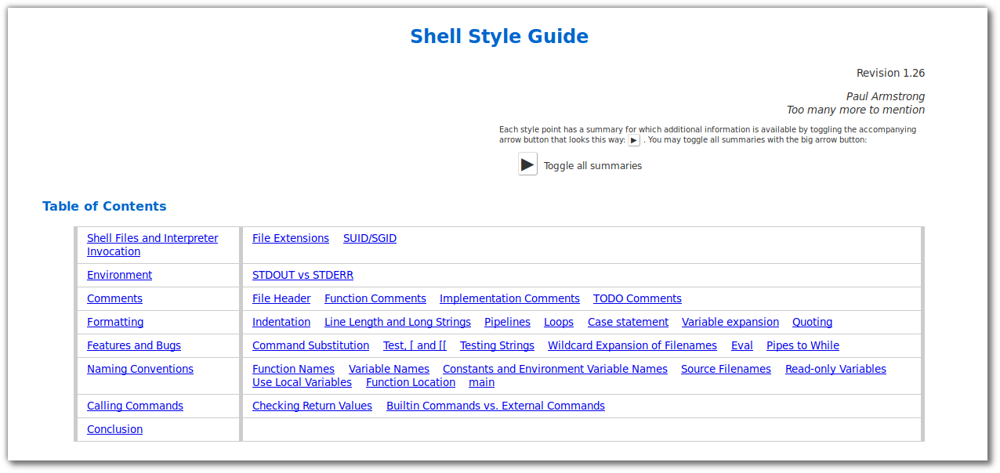
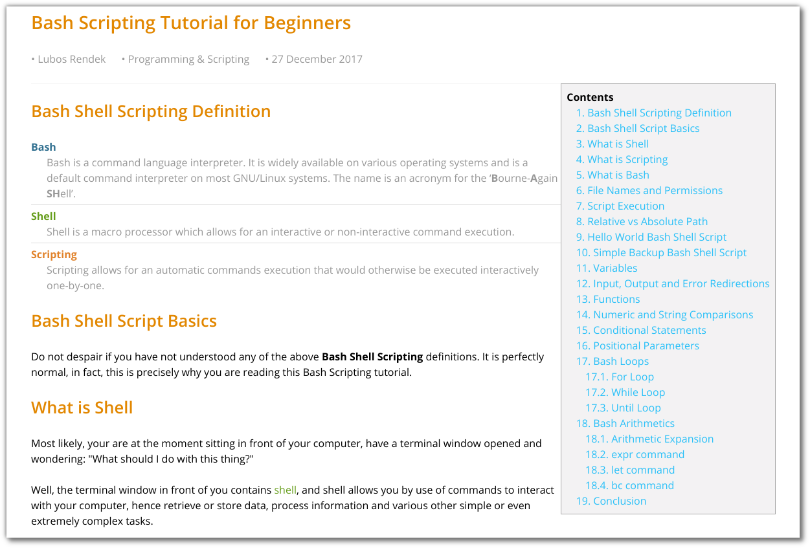
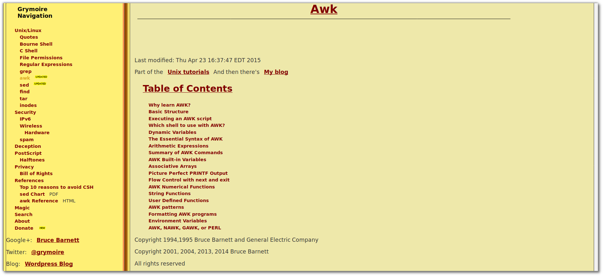

# De 0 a 100 con Bash Shell Scripting y AWK

Desde que empecé con Linux hace años, la consola, los scripts y yo nos hemos ido conociendo poco a poco hasta que ha surgido una bonita amistad. Hoy, en cuanto me surge la oportunidad juego con ellos para automatizar casi cualquier cosa de mi sistema operativo.

En esta charla quiero enseñar a programar scripts de Bash desde cero e ir subiendo la complejidad para terminar con AWK.

Originalmente es un taller que presenté en el [t3chfest](https://t3chfest.uc3m.es/2018/programa/taller-100-bash-shell-scripting-awk/) y que tuvo muy buena acogida, y que para el CommitConf he reducido y reestructurado como charla para que los que vengáis aprendáis los conceptos básicos de Bash y de AWK.

[Charla en el Commit Conf](https://www.koliseo.com/events/commit-2018/r4p/5630471824211968/agenda#/5116072650866688/6265425427955712)

## Recursos

### Slides de la charla

[Slides de la charla](https://asanzdiego.github.io/commit-conf-charla-shell-script-y-awk/)

### Plantilla de Bash Shell Script

[Plantilla de Bash Shell Script](https://github.com/asanzdiego/commit-conf-charla-shell-script-y-awk/blob/master/resources/template.sh)

### Chuleta de Bash Shell Script

[Chuleta de Bash Shell Script](https://github.com/asanzdiego/commit-conf-charla-shell-script-y-awk/blob/master/resources/chuleta-shell-script.pdf)

### ShellCheck, el lint de Bash Shell Script

[ShellCheck, el lint de Bash Shell Script](https://github.com/koalaman/shellcheck)

### Guía de estilo de Google de Bash Shell Script

[Guía de estilo de Google de Bash Shell Script](https://google.github.io/styleguide/shell.xml)

### Tutorial de Bash Shell Script

[Tutorial de Bash Shell Script](https://linuxconfig.org/bash-scripting-tutorial-for-beginners)

### Tutorial de AWK

[Tutorial de AWK](http://www.grymoire.com/Unix/Awk.html)

