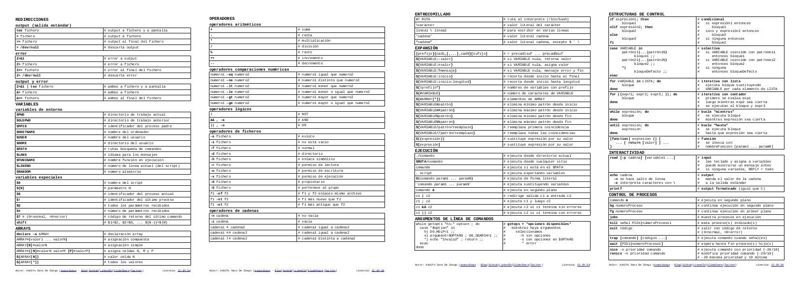

% De 0 a 100 con Bash Shell Scripting y AWK
% Adolfo Sanz De Diego
% Commit-Conf 2018

# Autor

## Adolfo Sanz De Diego

Asesor. Desarrollador. Profesor. Formador.

- Blog: [asanzdiego.com](https://www.asanzdiego.com/)
- Correo: [asanzdiego@gmail.com](mailto:asanzdiego@gmail.com)
- GitHub: [github.com/asanzdiego](http://github.com/asanzdiego)
- Twitter: [twitter.com/asanzdiego](http://twitter.com/asanzdiego)
- LinkedIn: [in/asanzdiego](http://www.linkedin.com/in/asanzdiego)
- SlideShare: [slideshare.net/asanzdiego](http://www.slideshare.net/asanzdiego/)

# Shell Script

## Hola mundo

- Un shell script es un **fichero de texto con comandos**, y no hay ni que compilar, ni tener nada instalado :-)

~~~
#! /bin/bash

echo "Hola mundo!"
~~~

## Permisos

- Antes de ejecutar hay que **darle permisos**, pero recuerda, un gran poder conlleva una gran responsabilidad :-)

~~~
$ chmod +x 01-hola-mundo.sh
~~~

## Ejecución

- Para ejecutar un script no hace falta ninguna guillotina :-) si está en el $PATH, el nombre directamente, sino desde la carpeta **./nombre.sh**

~~~
$ ./01_hola_mundo.sh
~~~

## Nombres

- Estas son mis **reglas de estilo** (en realidad de Google), si no te gustan tengo otras. :-)

~~~
ficheros_shell_scripts.sh
VARIABLES_DE_ENTORNO
variables_locales
nombres_de_funciones
~~~

## Parámetros

- Los parámetros los cogemos de la **linea de comandos** cuando ejecutamos.

~~~
$ ./02_parametros.sh param_1 param_2 ... param_N
~~~

~~~
param_1=$1
param_N=${N:-default}
num_params=$#
all_params=($@) # es un array
~~~

## Inicio

- Es una buena práctica **empezar los scripts** así:

~~~
#! /bin/bash

# Comentario con lo que hace el script

set -o errexit  # terminar el script si un comando falla
set -o pipefail # terminar el script si un comando falla en una tubería
set -o nounset  # terminar el script si usa una variable no declarada
# set -o xtrace # si quieres debuguear
~~~

## Exit

## Chuleta

<https://github.com/asanzdiego/curso-shell-script-2014>

## Exit

# Tips

## Funciones

~~~
_http_code () {
  local url="$1"
  curl --silent --head \
       --output /dev/null \
       --write-out "%{http_code}\n" \
       "$url"
}

~~~

- Usalo para hacer pequeños scripts, no grandes programas.

[Google Shell Style Guide](https://google.github.io/styleguide/shell.xml)

[ShellCheck](https://github.com/koalaman/shellcheck)

# Acerca de

## Licencia

- Creative Commons Reconocimiento-CompartirIgual 3.0  
    - <http://creativecommons.org/licenses/by-sa/3.0/es/>

## Fuentes

- Las fuentes las podéis encontrar en:
    - <https://github.com/asanzdiego/commit-conf-charla-shell-script-y-awk>

## Slides

- Las slides están hechas con **MarkdownSlides**
    - <https://github.com/markdownslides/markdownslides>

# Preguntas

# Gracias