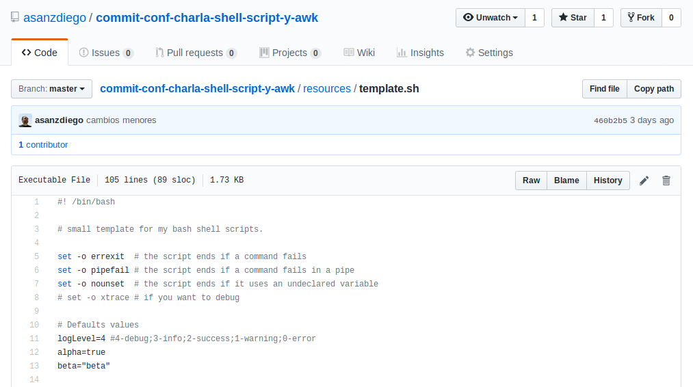
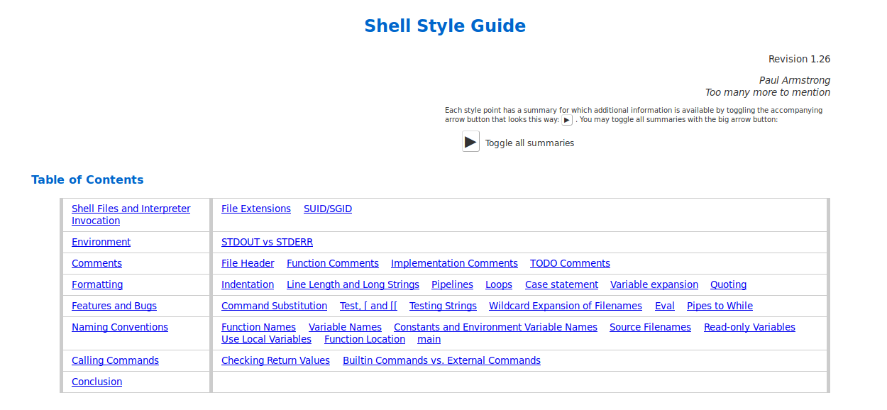
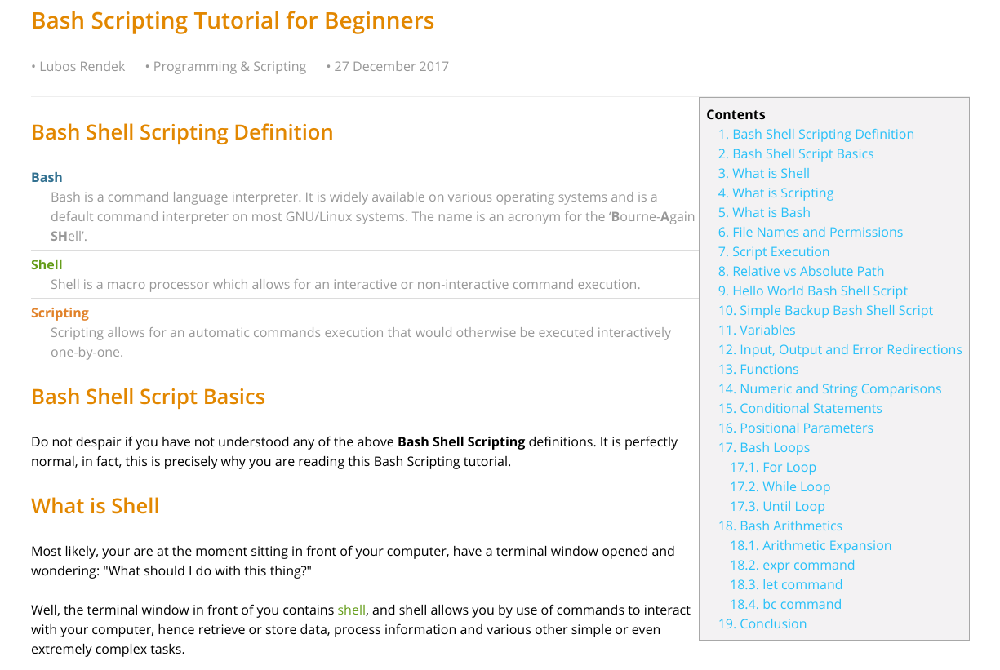
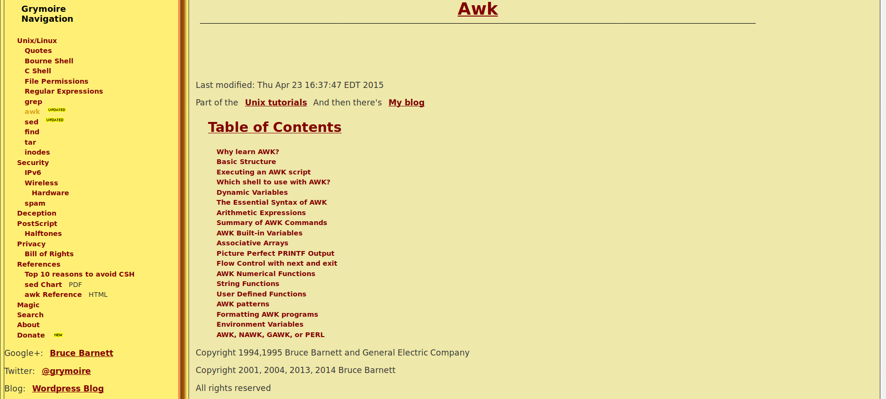

% De 0 a 100 con Bash Shell Scripting y AWK
% Adolfo Sanz De Diego
% Commit-Conf 2018

# Autor

## Adolfo Sanz De Diego

Asesor. Desarrollador. Profesor. Formador.

- Blog: [asanzdiego.com](https://www.asanzdiego.com/)
- Correo: [asanzdiego@gmail.com](mailto:asanzdiego@gmail.com)
- GitHub: [github.com/asanzdiego](http://github.com/asanzdiego)
- Twitter: [twitter.com/asanzdiego](http://twitter.com/asanzdiego)
- LinkedIn: [in/asanzdiego](http://www.linkedin.com/in/asanzdiego)
- SlideShare: [slideshare.net/asanzdiego](http://www.slideshare.net/asanzdiego/)

## Disclaimer

> - He intentado montar una charla útil **para principiantes**, pero **con tips para gente con más conocimientos**.
> - Espero haberlo conseguido :-) 

# Shell Script

## Introducción

> - Un shell script es un **fichero de texto con comandos**.
> - Para ejecutarlo **no hay ni que compilar, ni tener nada instalado**, y puedes utilizar todos los comandos del sistema.
> - Usalo para **automatizar tareas del sistema y/o procesar datos** de forma rápida.
> - Usalo para hacer **pequeños scripts, no grandes programas**, para eso tienes otros lenguajes.

## Hola mundo

~~~{.bash}
#! /bin/bash

# script showing a "Hello world!"

echo "Hello world!"
~~~

## Permisos

- Antes de ejecutar hay que **darle permisos**, pero recuerda, un gran poder conlleva una gran responsabilidad :-)

~~~{.bash}
$ chmod +x 01_hello_world.sh
~~~

## Ejecución

- Para ejecutar un script:
    - si está en el $PATH, **el nombre directamente**
    - si no, desde la carpeta, **./nombre.sh**

~~~{.bash}
$ ./01_hello_world.sh
~~~

[ejemplos/01_hola_mundo.sh](https://github.com/asanzdiego/commit-conf-charla-shell-script-y-awk/blob/master/ejemplos/01_hola_mundo.sh)

## Nombres

- Estas son mis **reglas de estilo** (en realidad de Google), si no te gustan tengo otras. :-)

~~~{.bash}
ficheros_shell_scripts.sh
VARIABLES_DE_ENTORNO
variables_locales
nombres_de_funciones
~~~

## Inicio

- Es una buena práctica **empezar los shells scripts** así:

~~~{.awk}
#! /bin/bash

# Short description of the script

set -o errexit  # the script ends if a command fails
set -o pipefail # the script ends if a command fails in a pipe
set -o nounset  # the script ends if it uses an undeclared variable
# set -o xtrace # if you want to debug
~~~

## Exit

- Es una buena práctica terminar los shells scripts con un un código de retorno:
    - **mayor de 0** si ha habido un error
    - **igual a 0** si termina correctamente (si no pones 'exit')

~~~{.bash}
#! /bin/bash

num_params=$#

if [ $num_params -lt 1 ]]; then
    echo "At least one parameter must be introduced."
    exit 1 # error and exits with a return code > 0
fi

echo "All ok" # ok and exits with a return code = 0
~~~

## Parciales

- Podemos guardar el resultado de la ejecución de comandos en variables:

~~~{.bash}
date=$(date +'%Y-%m-%d %H:%M:%S')
~~~

## Funciones

- Es una buena práctica asignar los **parámetros de la función** al principio ya sean como variables locales o, si es necesario, globales.

~~~{.awk}
my_function() {
  local function_param_1="$1"    # 1st param assigned as local
  global_param_2=${2:-default}   # 2nd param assigned as global (default)
  local function_num_params=$#   # numbers of params assigned as local
  local all_function_params=($@) # all params assigned as a local
}
~~~

~~~{.bash}
my_function function_param_1 function_param_2 ... function_param_N
~~~

## Parámetros

- Los parámetros los cogemos de la **linea de comandos** cuando ejecutamos.

~~~{.awk}
# Default values
default_2="Commit Conf"

param_1=$1                 # the first script param
param_2=${2:-${default_2}} # the second script param (with default value)
num_params=$#              # the numbers of script params
all_params=($@)            # all params assigned as an array
~~~

~~~{.bash}
$ ./02_parameters.sh param_1 param_2 ... param_N
~~~

[ejemplos/02_parametros.sh](https://github.com/asanzdiego/commit-conf-charla-shell-script-y-awk/blob/master/ejemplos/02_parametros.sh)

## Template

[template.sh](https://github.com/asanzdiego/commit-conf-charla-shell-script-y-awk/blob/master/template.sh)

## Chuleta

[chuleta-shell-script.pdf](https://github.com/asanzdiego/commit-conf-charla-shell-script-y-awk/blob/master/chuleta-shell-script.pdf)

## ShellCheck

<https://github.com/koalaman/shellcheck>

## Google Guide

<https://google.github.io/styleguide/shell.xml>

## Tutorial

<https://linuxconfig.org/bash-scripting-tutorial-for-beginners>

# AWK

## Introducción

> - Es una **hoja de cálculo** por línea de comandos.
> - Tiene **su propio penguaje** que es muy parecido a C.
> - Muy útil para **procesar datos dentro de un shell script**.
> - Muy útil para **hacer cosas raras con datos** y que con una hoja de cálculo normal es dificil de hacer.
> - Muy útil cuando **hay muchos datos** y una hoja de cálculo se queda colgada.

## Ejecución

~~~{.awk}
awk 'awk_program' data_file
~~~

~~~{.awk}
awk -f 'awk_program' data_file
~~~

## Grades

- Sacar las medias de los alumnos:

~~~{.awk}
Pepito      4.4  3.1  5.7
Fulanito    4.2  6.5  8.8
Menganito   5.6  5.0  5.3
~~~

~~~{.bash}
awk '{ print $1"="($2+$3+$4)/3 }' 03_grades.csv
~~~

[ejemplos/04_grades.sh](https://github.com/asanzdiego/commit-conf-charla-shell-script-y-awk/blob/master/ejemplos/04_grades.sh)

## Roles

- Agrupar por rol:

~~~{.awk}
Pepito:Jefe,Sistemas
Fulanito:Jefe,Desarrollo
Menganito:Operario,Sistemas,Desarrollo
~~~

~~~{.bash}
Sistemas -> Menganito Pepito 
Operario -> Menganito 
Jefe -> Fulanito Pepito 
Desarrollo -> Menganito Fulanito 
~~~

## Sin awk

~~~{.bash}
roles_file=./05_roles.csv

roles=$(cut -d : -f 2 $roles_file | sed 's/,/\n/g' | sort | uniq)

for rol in $roles; do
  echo -n "${rol} -> "
  echo $(grep -E "${rol}" "${roles_file}" | cut -d : -f 1)
done
~~~

[ejemplos/06_roles_sin_awk.sh](https://github.com/asanzdiego/commit-conf-charla-shell-script-y-awk/blob/master/ejemplos/06_roles_sin_awk.sh)

## Con awk

~~~{.awk}
# this will run only once at first
BEGIN { FS = ",|:" }
# this will be executed for each of the lines in the file
{
  name=$1
  for (i=2; i<=NF; i++) {
    roles[$i]=roles[$i]" "old_names
  }
}
# This will only run once at the end
END {
  for (rol in roles) {
    print rol" -> " roles[rol]
  }
}
done
~~~

[ejemplos/07_roles_con_awk.sh](https://github.com/asanzdiego/commit-conf-charla-shell-script-y-awk/blob/master/ejemplos/07_roles_con_awk.sh)

## Tutorial

<http://www.grymoire.com/Unix/Awk.html>

# Acerca de

## Licencia

- Creative Commons Reconocimiento-CompartirIgual 3.0  
    - <http://creativecommons.org/licenses/by-sa/3.0/es/>

## Fuentes

- Las fuentes las podéis encontrar en:
    - <https://github.com/asanzdiego/commit-conf-charla-shell-script-y-awk>

## Slides

- Las slides están hechas con **MarkdownSlides**
    - <https://github.com/markdownslides/markdownslides>

# Preguntas

# Gracias